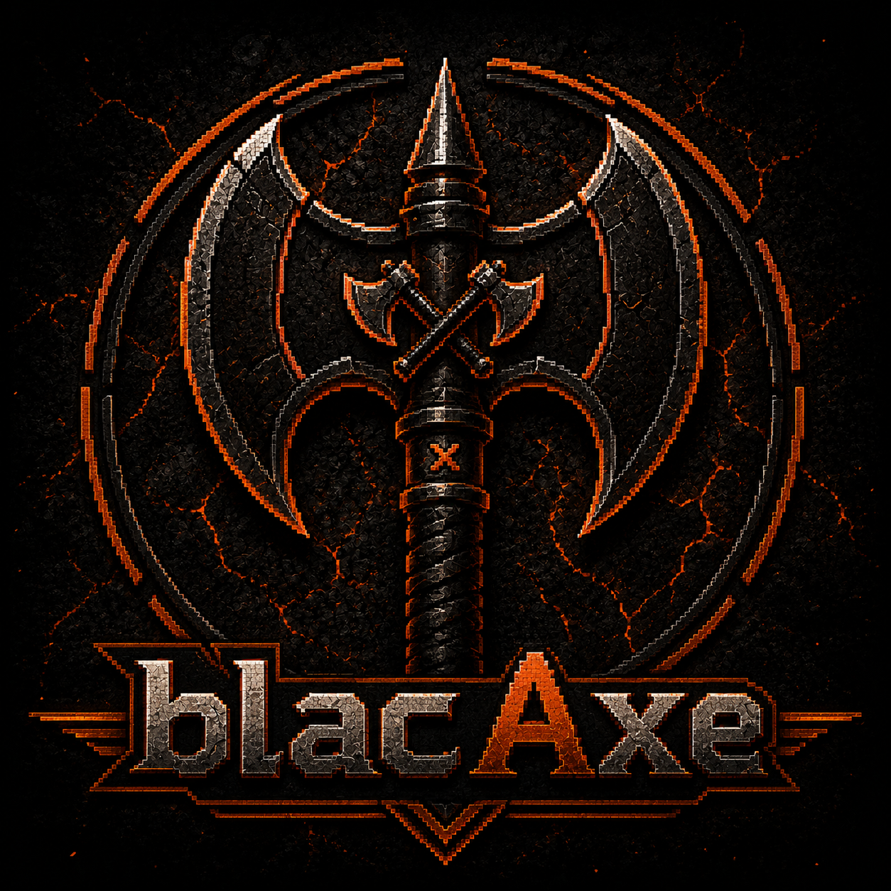

<p align="center">
  
</p>

# Omar Halane

Software Engineer focused on security engineering, distributed systems, operating systems, embedded robotics, and machine learning.

I enjoy building production-inspired systems from the ground up to better understand how software, infrastructure, networking, and hardware work together. Most of my work centers around designing complete systems rather than isolated applications.

---

## Table of Contents

- [Featured Projects](#featured-projects)
- [Project Portfolio](#project-portfolio)
- [Current Interests](#current-interests)

---

# Featured Projects

<details>
<summary><strong>Sentinel Platform</strong></summary>

A distributed security engineering workspace composed of multiple services for authentication, reverse proxy protection, observability, malware analysis, infrastructure monitoring, and centralized management.

```
Sentinel Platform
├── Sentinel OS
├── Sentinel Platform
├── Sentinel Proxy
├── Zero Trust Identity Provider
├── LumenLog
└── VORTEX
```

Repositories

- [Sentinel OS](https://github.com/blacAxe/sentinel-os-v1)
- [Sentinel Platform](https://github.com/blacAxe/sentinel-platform-v1)
- [Sentinel Proxy](https://github.com/blacAxe/sentinel-proxy)
- [Zero Trust Identity Provider](https://github.com/blacAxe/sentinel-idp)
- [LumenLog](https://github.com/blacAxe/lumenlog)
- [VORTEX](https://github.com/blacAxe/vortex)

</details>

<br>

<details>
<summary><strong>Atlas Robot</strong></summary>

An autonomous robotics engineering project featuring custom Arduino firmware, multi-sensor navigation, obstacle avoidance, Wi-Fi telemetry, and a web-based monitoring dashboard.

```
Atlas Robot
└── Atlas Robot V2
```

Repository

- [Atlas Robot V2](https://github.com/blacAxe/atlas-robot-v2)

</details>

<br>

<details>
<summary><strong>Hardened xv6</strong></summary>

A research-driven operating systems project extending the RISC-V xv6 kernel with auditing, memory randomization, access control, and integrity verification.

```
Hardened xv6
└── xv6 Security Lab
```

Repository

- [xv6 Security Lab](https://github.com/blacAxe/xv6-security-lab)

</details>

---

# Project Portfolio

<details open>
<summary><strong>Security Engineering</strong></summary>

| Repository | Description |
|------------|-------------|
| [Sentinel OS](https://github.com/blacAxe/sentinel-os-v1) | Security-focused operating system workspace |
| [Sentinel Platform](https://github.com/blacAxe/sentinel-platform-v1) | Distributed security platform |
| [Sentinel Proxy](https://github.com/blacAxe/sentinel-proxy) | Reverse proxy and web application firewall |
| [Zero Trust Identity Provider](https://github.com/blacAxe/sentinel-idp) | Authentication and identity service |
| [Self-Healing Security Lab](https://github.com/blacAxe/self-healing-security-lab) | Interactive security sandbox |
| [xv6 Security Lab](https://github.com/blacAxe/xv6-security-lab) | Hardened RISC-V xv6 kernel |

</details>

<details open>
<summary><strong>Distributed Systems</strong></summary>

| Repository | Description |
|------------|-------------|
| [LumenLog](https://github.com/blacAxe/lumenlog) | Logging and observability pipeline |
| [VORTEX](https://github.com/blacAxe/vortex) | Event-driven backend infrastructure |

</details>

<details open>
<summary><strong>Robotics & Embedded Systems</strong></summary>

| Repository | Description |
|------------|-------------|
| [Atlas Robot V2](https://github.com/blacAxe/atlas-robot-v2) | Autonomous robot with telemetry, navigation, and embedded firmware |

</details>

<!-- <details open>
<summary><strong>Machine Learning</strong></summary>

| Repository | Description |
|------------|-------------|
| NumPy MNIST Neural Network | Neural network built from scratch using NumPy |
| MLP Name Generator | Character-level neural network experiments |

</details> -->

---

# Current Interests

- Security Engineering
- Distributed Systems
- Operating Systems
- Embedded Systems
- Robotics
- Machine Learning

---

Thanks for visiting.