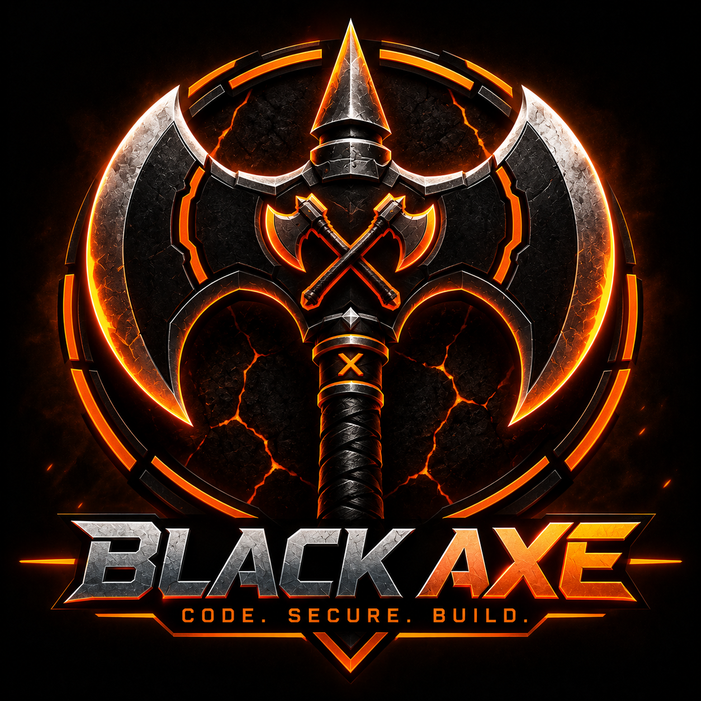

  

# Omar Halane

Software Engineer focused on security engineering, distributed systems, operating systems, embedded robotics, and machine learning. I enjoy building production-inspired systems from the ground up to understand how software, infrastructure, and hardware work together.

---

## Featured Systems

### Sentinel Platform
A distributed security platform composed of multiple backend services that work together to provide authentication, reverse proxy protection, observability, malware analysis, and real-time telemetry. The platform includes Sentinel Proxy, Zero Trust Identity Provider, LumenLog, VORTEX, and a web-based management console. :contentReference[oaicite:0]{index=0}

### Atlas Robot
A physical autonomous robotics platform combining custom Arduino firmware, multi-sensor obstacle avoidance, live telemetry, and a monitoring dashboard to explore embedded systems and autonomous navigation. :contentReference[oaicite:1]{index=1}

### Hardened xv6 Kernel
A security-focused operating systems project extending the RISC-V xv6 kernel with kernel auditing, stack ASLR, access control, and integrity monitoring to explore low-level systems security. :contentReference[oaicite:2]{index=2}

---

## Security Engineering
- Sentinel Platform
- Sentinel Proxy
- Zero Trust Identity Provider
- Self-Healing Security Lab
- Hardened xv6 Kernel

## Distributed Systems
- LumenLog
- VORTEX
- Distributed Passwords

## Robotics & Embedded Systems
- Atlas Robot

## Machine Learning
- NumPy MNIST Neural Network
- MLP Name Generatorex-backend

<!--
**blacAxe/blacAxe** is a ✨ _special_ ✨ repository because its `README.md` (this file) appears on your GitHub profile.

Here are some ideas to get you started:

- 🔭 I’m currently working on ...
- 🌱 I’m currently learning ...
- 👯 I’m looking to collaborate on ...
- 🤔 I’m looking for help with ...
- 💬 Ask me about ...
- 📫 How to reach me: ...
- 😄 Pronouns: ...
- ⚡ Fun fact: ...
-->
